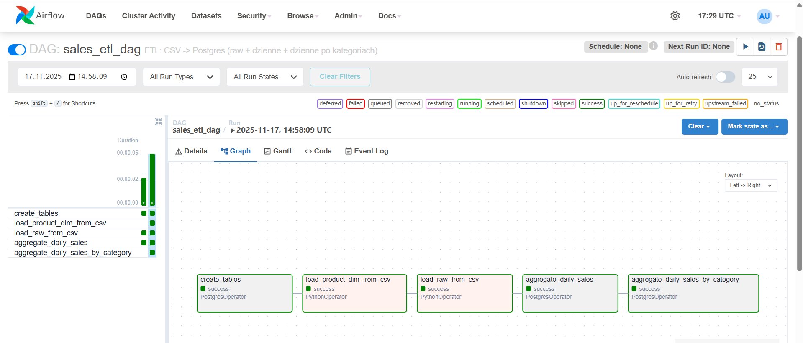
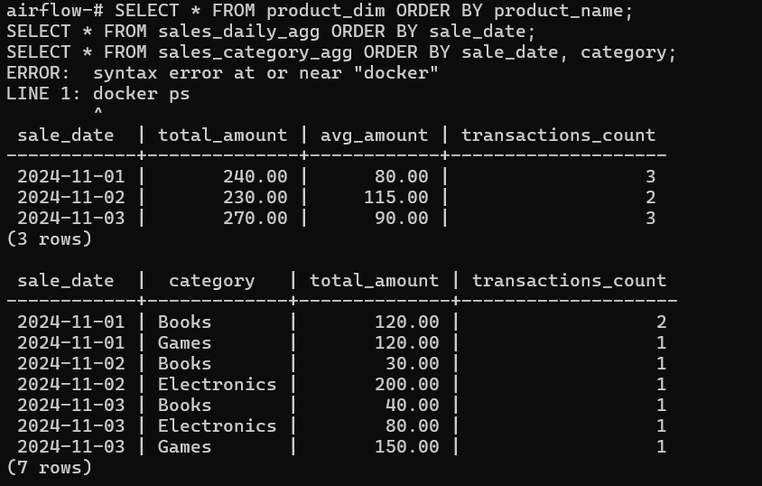

# Mini ETL: Airflow + Postgres + Docker (sprzedaż dzienna i po kategoriach)

Projekt pokazuje prosty, ale realistyczny pipeline ETL zbudowany na:
- **Docker + docker-compose**
- **Apache Airflow** (scheduler / orkiestracja)
- **PostgreSQL** (warstwa danych)
- **Python (DAG + logika ładowania CSV)**

Pipeline ładuje dane sprzedażowe z plików CSV do Postgresa i buduje dwie warstwy agregacji:
- dzienną sprzedaż,
- dzienną sprzedaż po kategoriach produktowych.

## 1. Architektura

Całość działa w kontenerach Docker:

- `postgres` – baza danych z tabelami:
  - `product_dim` – wymiar produktów (product → category),
  - `sales_raw` – warstwa „raw” (pojedyncze transakcje),
  - `sales_daily_agg` – dzienne agregaty (sumy, średnie, liczność),
  - `sales_category_agg` – dzienne agregaty po kategoriach.
- `airflow-webserver` – UI Airflow (`http://localhost:8080`)
- `airflow-scheduler` – scheduler, który wykonuje DAG-i

Pliki projektu (lokalnie):

```text
airflow_postgres_project/
  ├─ dags/
  │   ├─ sales_etl_dag.py         # główny DAG ETL
  │   └─ data/
  │       ├─ sales_data.csv       # dane sprzedażowe (fakt)
  │       └─ products.csv         # słownik produktów (wymiar)
  ├─ docker-compose.yml           # definicja stacka Docker
  └─ README.md                    # (ten plik)
```

## 2. Uruchomienie projektu

### Wymagania

- **Docker Desktop** z włączonym backendem Linux
- (Opcjonalnie) PowerShell / bash do wygodnego odpalania poleceń

### 2.1. Start kontenerów

W katalogu projektu:

```bash
docker compose up -d
```

Powinny uruchomić się 3 serwisy:

- `airflow_pg`
- `airflow_postgres_project-airflow-webserver-1`
- `airflow_postgres_project-airflow-scheduler-1`

Można to sprawdzić:

```bash
docker ps
```

### 2.2. Inicjalizacja bazy Airflow (jednorazowo)

```bash
docker compose run --rm airflow-webserver airflow db init
docker compose up -d
```

### 2.3. Utworzenie użytkownika w Airflow

```bash
docker exec -it airflow_postgres_project-airflow-webserver-1 airflow users create   --username admin   --firstname Admin   --lastname User   --role Admin   --email admin@example.com   --password admin
```

### 2.4. Connection do Postgresa (conn_id: `postgres_business`)

```bash
docker exec -it airflow_postgres_project-airflow-webserver-1   airflow connections add postgres_business   --conn-type postgres   --conn-host postgres   --conn-login airflow   --conn-password airflow   --conn-port 5432   --conn-schema airflow
```

## 3. Wejście do UI Airflow

Panel Airflow:

- URL: `http://localhost:8080`
- Login: `admin`
- Hasło: `admin`

Na liście DAG-ów powinien być widoczny:

- `sales_etl_dag`

Włącz go (suwak na ON), następnie wejdź do DAG-a i użyj przycisku **„Trigger DAG”**, aby uruchomić pipeline.




---


## 5. Logika DAG-a (`sales_etl_dag.py`)

DAG składa się z pięciu głównych tasków (działających w tej kolejności):

1. **`create_tables`** – tworzy tabele, jeśli nie istnieją:

   - `product_dim`
   - `sales_raw`
   - `sales_daily_agg`
   - `sales_category_agg`

2. **`load_product_dim_from_csv`** (PythonOperator)

   - czyści tabelę `product_dim`,
   - ładuje dane z `products.csv`,
   - mapping `product_name → category`.

3. **`load_raw_from_csv`** (PythonOperator)

   - czyści tabelę `sales_raw`,
   - ładuje dane z `sales_data.csv`,
   - zapisuje transakcje (data, produkt, kwota).

4. **`aggregate_daily_sales`** (PostgresOperator)

   - liczy dzienną sprzedaż


5. **`aggregate_daily_sales_by_category`** (PostgresOperator)

   - łączy `sales_raw` z `product_dim` i liczy sprzedaż po kategoriach

---

## 6. Struktura tabel i przykładowe wyniki

Po udanym przebiegu DAG-a, w Postgresie (kontener `airflow_pg`) można sprawdzić wyniki:

```bash
docker exec -it airflow_pg psql -U airflow -d airflow
```

### 6.1. Wymiar produktów

```sql
SELECT * FROM product_dim ORDER BY product_name;
```

Przykład:

```text
 product_name |  category
--------------+-------------
 Book         | Books
 Game         | Games
 Keyboard     | Electronics
 Mouse        | Electronics
```

### 6.2. Dane surowe

```sql
SELECT * FROM sales_raw ORDER BY sale_date, id;
```

### 6.3. Agregaty dzienne

```sql
SELECT * FROM sales_daily_agg ORDER BY sale_date;
```

Przykład:

```text
 sale_date  | total_amount | avg_amount | transactions_count
------------+--------------+------------+--------------------
 2024-11-01 |       240.00 |      80.00 |                  3
 2024-11-02 |       230.00 |     115.00 |                  2
 2024-11-03 |       270.00 |      90.00 |                  3
```

### 6.4. Agregaty dzienne po kategoriach

```sql
SELECT * FROM sales_category_agg ORDER BY sale_date, category;
```

Przykład:

```text
 sale_date  |  category   | total_amount | transactions_count
------------+-------------+--------------+--------------------
 2024-11-01 | Books       |       120.00 |                  2
 2024-11-01 | Games       |       120.00 |                  1
 2024-11-02 | Books       |        30.00 |                  1
 2024-11-02 | Electronics |       200.00 |                  1
 2024-11-03 | Books       |        40.00 |                  1
 2024-11-03 | Electronics |        80.00 |                  1
 2024-11-03 | Games       |       150.00 |                  1
```

---

## 8. Podsumowanie

Ten projekt pokazuje:

- uruchomienie **Airflowa i Postgresa w Dockerze**,
- konfigurację **connection** w Airflow (`postgres_business`),
- implementację **DAG-a ETL** w Pythonie:
  - ładowanie danych z CSV,
  - model **wymiar + fakt**,
  - agregacje dzienne + dzienne po kategoriach.




